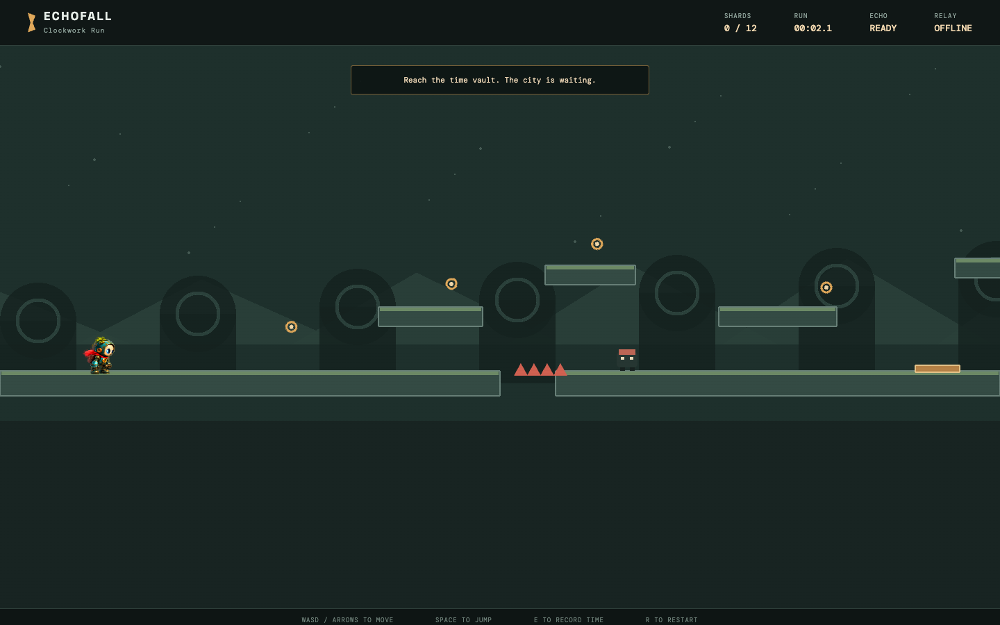

# Echofall: Clockwork Run

A browser-based 2D platformer built for a community Mario-style game build. Pilot a courier automaton through an overgrown clockwork city and use the **Time Echo** to record and replay your movements — hold pressure plates, time shutter runs, and unlock gated vaults.



## Features

- One hand-crafted side-scrolling level across four echo chambers
- Responsive run, jump, acceleration, friction, and coyote time with buffered jumps
- Spike hazards, crawler enemies, collectible memory shards, and a score HUD
- A six-second Time Echo recording with positional playback
- Checkpoints, respawn, pause, restart, and victory states
- Run timer with persistent best time, shard challenge, and completion ranks
- Procedural ambience and action sound effects with mute control
- Original code-rendered art — no Nintendo assets or branding

## Tech

- [Phaser 3](https://phaser.io/) game framework
- TypeScript
- Vite for development and building
- Vitest for tests

## Getting started

```bash
npm install
npm run dev
```

Production build and tests:

```bash
npm run build
npm test
```

## Documentation

- [MVP](docs/MVP.md)
- [Technical plan](docs/TECHNICAL_PLAN.md)
